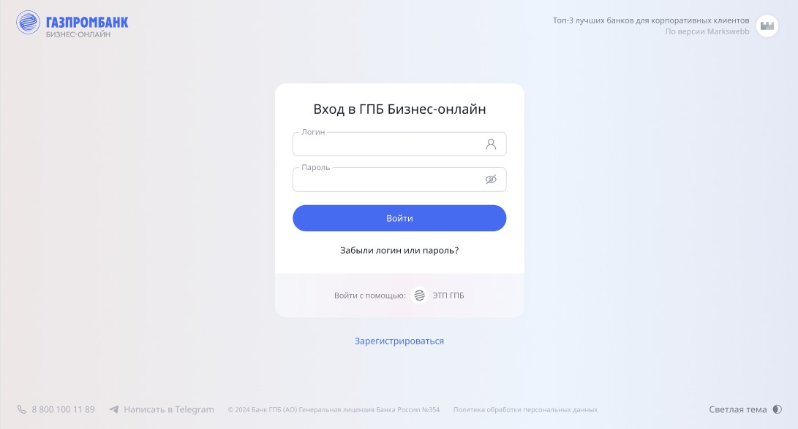
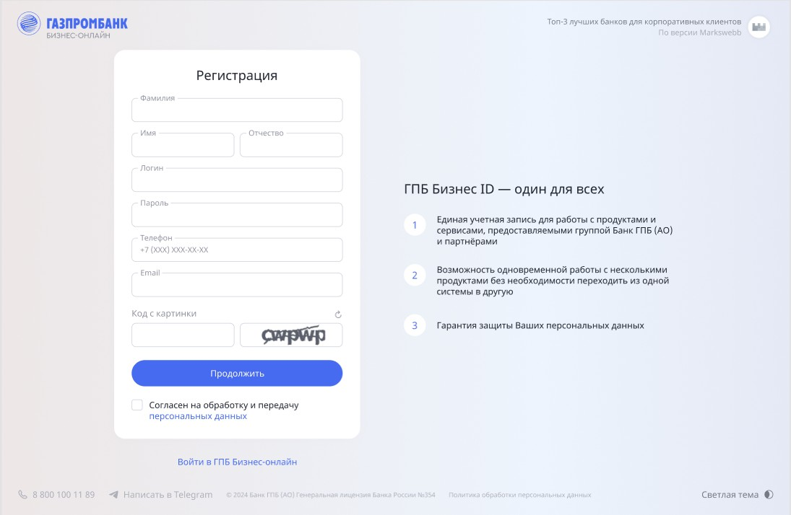

# :fire: Газпромбанк

Страницу входа и её вариация с окном восстановления пароля, а также страницу регистрации.

Каждая страница была свёрстана адаптивно под любую ширину и высоту экрана. В состояниях интерактивных элементов заложен отклик на наведение курсором и/ли переход с помощью клавиши tab. 

## 💻 О проекте
Проект был реализован в рамках выполнения курса по фронтенд-разработке. 

## :art: Макеты страниц

Были нарисованы с помощью [Figma](https://www.figma.com/design/mEOvCD4YfuIBP5CCqQae1q/%D0%93%D0%B0%D0%B7%D0%BF%D1%80%D0%BE%D0%BC%D0%B1%D0%B0%D0%BD%D0%BA---%D0%A0%D0%B0%D0%B7%D1%80%D0%B0%D0%B1%D0%BE%D1%82%D0%BA%D0%B0-FWEB-9793?node-id=2-265&t=isVU9lQ2FBZz0Pmy-0), графического онлайн-редактора.

Для страниц были предусмотрены состояния наведения, фокуса, активности, неактивности к интерактивным элементам.

| Вход | Изменение пароля | Регистрация |
|-------------|-------------|-------------|
|  |  |  |

## 📂 Структура проекта
```
gazprombank
├── css                       # Стили CSS 
│   └── global                # Глобальные стили
│       └── (файлы стилей) 
│   └── blocks                # Стили компонентов
│       └── (файлы стилей) 
├── fonts                     # Шрифты 
│   └── (файлы шрифтов) 
├── images                    # Изображения 
│   └── (файлы изображений)
├── forgot-data.html          # Страница сброса пароля
├── login.html                # Страница входа
└── registration.html         # Страница регистрации
```
